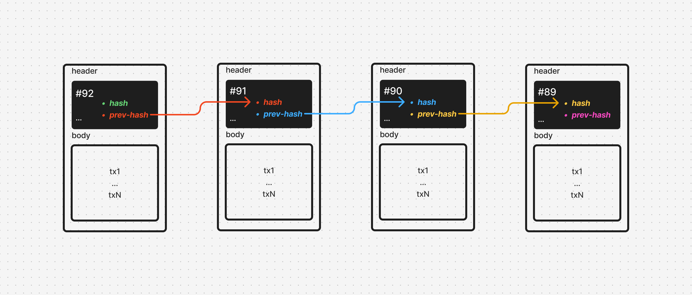
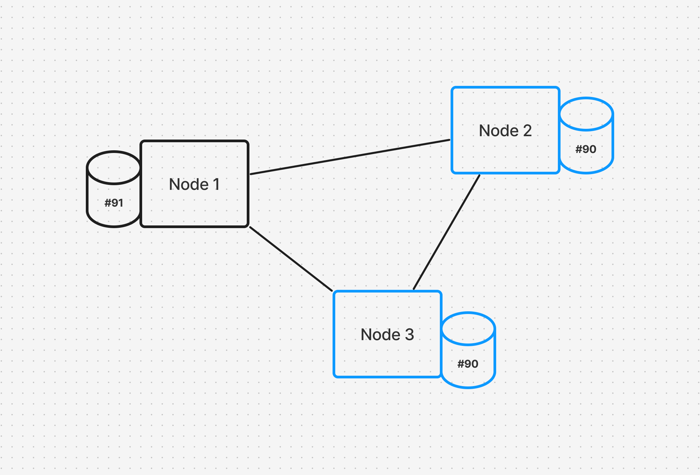

# **Workshop: Road to Meridian**

## **Dia 1: Introdução a Smartcontracts em Rust para Stellar**

---

## Abertura

Bem-vindos ao **Workshop: Road to Meridian 2**! Hoje vamos mergulhar no mundo dos smartcontracts na Stellar Network usando Rust. Esta aula vai colocar todos na mesma página sobre blockchain, apresentar a Stellar Network, explicar como funcionam os smartcontracts e fazer nosso primeiro deploy!

---

### Programa da aula:

0. **Quem somos e o que é o Road to Meridian**
1. **Conceitos Fundamentais de Blockchain**
2. **Stellar Network: A Blockchain para Pagamentos Globais**
3. **Smartcontracts na Stellar com Soroban**
4. **Deploy do Primeiro Hello World**

---

## 0. Quem somos e o que é o Road to Meridian

### Lucas Oliveira

- Matemático (formado em 2021).
- +5 anos como Engenheiro Senior de Blockchain.
- Criação de Layer 1, SDKs, smart contracts (EVM e não-EVM).
- Liderou a entrega de 2 Projetos do DREX.
- Embaixador da Stellar no Brasil.
- Contribuidor F/OSS: +3 bibliotecas crypto publicadas.
- Head of Education @ NearX: Liderança em educação blockchain na LATAM.

---

### NearX

- Plataforma de educação em tecnologias emergentes (Web3, IA, Blockchain).
- Consultoria em Blockchain para Empresas.
- 30 Alunos na Pós Graduação Lato Senso.
- +9.000 alunos na Plataforma.
- +2.500 membros no Discord.
- Oferece: Pós-graduação, Plataforma por assinatura, Mentorias, Bootcamps, Hackathons
- Parcerias: Stellar, Animoca Brands, Optimism, Arbitrum, Starknet, ZkVerify, MultiverseX.

---

### Stellar

- +13Bi de captalização de mercado.
- Fundada em 2014 pelo Jed McCaleb, founder da Mt. Gox e co-founder da Ripple.
- Smartcontracts em Rust lançados em 2022 por Grandon Hoare.

---

### Road to Meridian

#### Workshop 1: Introdução ao Rust

- Aula 1: Criar e Publicar Bibliotecas em Rust
- Aula 2: Criar e Deployar Rest API CRUD em Rust
- Aula 3: Criar e Integrar WebAssembly em Rust

---

#### Workshop 2: Smartcontracts Básico na Stellar com Soroban

- Aula 1: Básico de Blockchain e Hello World
- Aula 2: Smartcontracts e Integração com Backend
- Aula 3: Smartcontracts e Integração com Frontend

---

#### Workshop 3: Smartcontracts Avançado na Stellar com Soroban

- Aula 1: Segurança em Smartcontracts
- Aula 2: Composabilidade em Protocolos Soroban
- Aula 3: Implementando Passkey Authn

---

## 1. Conceitos Fundamentais de Blockchain

Para entender smartcontracts, precisamos primeiro dominar os conceitos básicos de blockchain. Vamos começar pelos pilares fundamentais!

```
Wallets -> Transações -> Blocos -> Consenso -> Smartcontracts
```

---

### Wallets


---

### Transações


---

### Blocos



---

### Consenso



---

## 2. Stellar Network: A Blockchain para Pagamentos Globais

A Stellar é uma blockchain focada em pagamentos globais rápidos e baratos. Vamos entender suas características únicas!

### Características da Stellar

**Velocidade:**

- Transações confirmadas em 3-5 segundos
- Throughput de ~1000 transações por segundo

**Custo:**

- Fees extremamente baixas (0.00001 XLM)
- Ideal para micropagamentos

**Sustentabilidade:**

- Não usa mineração
- Consumo energético mínimo

### Stellar Consensus Protocol (SCP)

**Como Funciona:**

- Cada nó escolhe outros nós em quem confia
- Forma "quorum slices" para validação
- Consenso sem necessidade de token staking

**Vantagens:**

- Descentralizado mas eficiente
- Resistente a falhas bizantinas
- Flexível na escolha de validadores

### Ecossistema Stellar

**Lumens (XLM):**

- Token nativo da rede
- Usado para fees e anti-spam
- Bridge currency para trocas

**Anchors:**

- Entidades que emitem tokens na Stellar
- Representam ativos do mundo real
- Facilitam on/off ramps

**Stellar Development Foundation:**

- Organização sem fins lucrativos
- Desenvolve e mantém a rede
- Foca em inclusão financeira

---

## 3. Smartcontracts na Stellar com Soroban

Agora vamos entender como os smartcontracts funcionam na Stellar através do Soroban!

### O que é Soroban?

**Soroban** é a plataforma de smartcontracts da Stellar:

- Lançada em 2023
- Usa WebAssembly (Wasm) como runtime
- Suporte nativo para Rust
- Integração perfeita com a Stellar Network

### Por que Rust?

**Vantagens do Rust:**

- Segurança de memória sem garbage collector
- Performance próxima ao C/C++
- Sistema de tipos robusto
- Comunidade ativa e crescente

**Rust + Wasm:**

- Compilação eficiente para WebAssembly
- Execução determinística
- Portabilidade entre plataformas

### VMs e Runtimes

**WebAssembly (Wasm):**

- Bytecode portável e eficiente
- Sandbox seguro para execução
- Suporte a múltiplas linguagens

**Outras VMs:**

- **eBPF:** Linux kernel programs
- **RISC-V:** Arquitetura de processador aberta
- **EVM:** Ethereum Virtual Machine
- **Move:** Linguagem da Diem/Aptos
- **Cairo:** Linguagem da StarkNet

### Ferramentas de Desenvolvimento

**Stellar SDK:**

- Bibliotecas para interagir com Stellar
- Suporte a múltiplas linguagens
- Facilita integração com aplicações

**Soroban CLI:**

- Ferramenta de linha de comando
- Deploy e teste de contratos
- Interação com a rede

**Stellar Plus:**

- Framework de alto nível
- Simplifica desenvolvimento de dApps
- Abstrações úteis para casos comuns

---

## 4. Deploy do Primeiro Hello World

Vamos colocar a mão na massa e fazer nosso primeiro smartcontract!

### Estrutura de um Contrato Soroban

**DSL (Domain Specific Language):**

```rust
#[contract]
pub struct HelloContract;

#[contractimpl]
impl HelloContract {
    pub fn hello(env: Env, to: Symbol) -> Vec<Symbol> {
        vec![&env, symbol_short!("Hello"), to]
    }
}
```

**No STD:**

- Contratos Soroban não usam a standard library
- Ambiente restrito para determinismo
- Usa `soroban-sdk` em vez de `std`

**Env (Environment):**

- Interface com o runtime Soroban
- Acesso a storage, eventos, criptografia
- Gerenciamento de recursos

### Ciclo de Desenvolvimento

**1. Compilar:**
MOSTRAR TERMINAL: `cargo build --target wasm32-unknown-unknown --release`

**2. Testar:**
MOSTRAR TERMINAL: `cargo test`

**3. Upload:**
MOSTRAR TERMINAL: `soroban contract deploy --wasm target/wasm32-unknown-unknown/release/hello_world.wasm --source alice --network testnet`

**4. Install:**
MOSTRAR TERMINAL: `soroban contract install --wasm target/wasm32-unknown-unknown/release/hello_world.wasm --source alice --network testnet`

**5. Interagir:**
MOSTRAR TERMINAL: `soroban contract invoke --id CONTRACT_ID --source alice --network testnet -- hello --to world`

### Primeiro Projeto

MOSTRAR TERMINAL: `cargo new --lib hello_world`

MOSTRAR ARVORE DE ARQUIVOS:

```
hello_world/
├── Cargo.toml
└── src/
    └── lib.rs
```

MOSTRAR CRIACAO DE MODULO: `Cargo.toml`

```toml
[package]
name = "hello_world"
version = "0.1.0"
edition = "2021"

[lib]
crate-type = ["cdylib"]

[dependencies]
soroban-sdk = "20.0.0"

[dev-dependencies]
soroban-sdk = { version = "20.0.0", features = ["testutils"] }

[profile.release]
opt-level = "z"
overflow-checks = true
debug = 0
strip = "symbols"
debug-assertions = false
panic = "abort"
codegen-units = 1
lto = true
```

MOSTRAR CRIACAO DA FUNCAO: `src/lib.rs`

```rust
#![no_std]
use soroban_sdk::{contract, contractimpl, symbol_short, vec, Env, Symbol, Vec};

#[contract]
pub struct HelloContract;

#[contractimpl]
impl HelloContract {
    pub fn hello(env: Env, to: Symbol) -> Vec<Symbol> {
        vec![&env, symbol_short!("Hello"), to]
    }
}

mod test;
```

---

## Revisão

1. **Conceitos Fundamentais de Blockchain**

- [x] Wallets gerenciam chaves e facilitam interação com blockchain
- [x] Transações têm operações, fees e passam por ciclo de validação
- [x] Blocos contêm transações e são criados via consenso
- [x] Stellar usa SCP: consenso federado bizantino eficiente

2. **Stellar Network: A Blockchain para Pagamentos Globais**

- [x] Transações rápidas (3-5s) e baratas (0.00001 XLM)
- [x] SCP permite consenso sem mineração ou staking
- [x] Ecossistema focado em inclusão financeira global
- [x] XLM como token nativo e bridge currency

3. **Smartcontracts na Stellar com Soroban**

- [x] Soroban usa WebAssembly como runtime para contratos
- [x] Rust oferece segurança e performance para desenvolvimento
- [x] Ferramentas: Stellar SDK, Soroban CLI, Stellar Plus
- [x] Contratos usam DSL específica e ambiente no_std

4. **Deploy do Primeiro Hello World**

- [x] Estrutura básica: #[contract] e #[contractimpl]
- [x] Ciclo: compilar → testar → upload → install → interagir
- [x] Configuração específica no Cargo.toml para Wasm
- [x] Uso do Env para interagir com runtime Soroban

---

## Lição de casa

### Desafio de Aprendizagem

- **fácil:** Modifique o Hello World para retornar uma mensagem personalizada
- **médio:** Crie um contador que incrementa e retorna o valor atual
- **difícil:** Implemente um contrato de votação simples com múltiplas opções

**Recursos:**

- [Soroban Documentation](https://soroban.stellar.org/docs)
- [Stellar Developers](https://developers.stellar.org/)
- [Soroban Examples](https://github.com/stellar/soroban-examples)
- [Rust Book](https://doc.rust-lang.org/book/)

### Desafio de Carreira

- Post no LinkedIn e Twitter com #road2meridian (1/3)
- Marque a Stellar (@StellarOrg)
- Marque a NearX (@NearX\_)

### Desafio de Comunidade

- Poste uma foto da sua mesa de trabalho! (discord da nearx)
- Poste uma mensagem para encorajar as pessoas (discord da stellar)

---

## Próxima Aula

Na próxima aula, vamos explorar **Tipos de Dados e Storage em Soroban**. Até lá!
