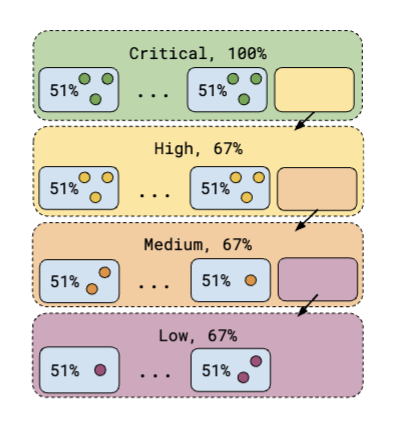
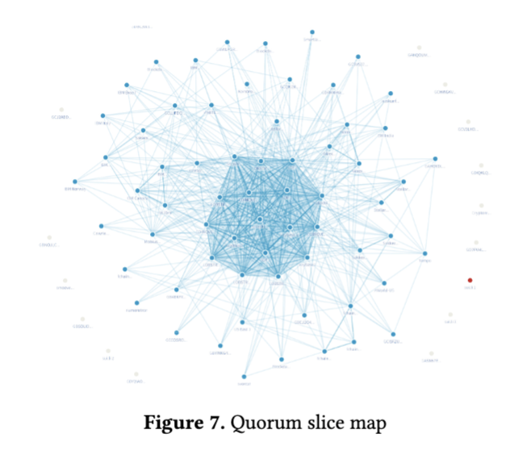

# **Workshop: Road to Meridian 2**

## **Dia 1: Introdução a Smartcontracts em Rust para Stellar**

---

## Abertura

Bem-vindos ao **Workshop: Road to Meridian 2**! Hoje vamos mergulhar no mundo dos smartcontracts na Stellar Network usando Rust. Esta aula vai colocar todos na mesma página sobre blockchain, apresentar a Stellar Network, explicar como funcionam os smartcontracts e fazer nosso primeiro deploy!

### Programa da aula:

0. **Quem somos e o que é o Road to Meridian?**
1. **Conceitos Fundamentais de Blockchain**
2. **Stellar Network: A Blockchain para Pagamentos Globais**
3. **Smartcontracts na Stellar com Soroban**
4. **Deploy do Primeiro Hello World**

---

## 0. Apresentação

### Lucas Oliveira

- Matemático (formado em 2021).
- +5 anos como Engenheiro Senior de Blockchain.
- Criação de Layer 1, SDKs, smart contracts (EVM e não-EVM).
- Liderou a entrega de 2 Projetos do DREX.
- Embaixador da Stellar no Brasil.
- Contribuidor F/OSS: +3 bibliotecas crypto publicadas.
- Head of Education @ NearX: Liderança em educação blockchain na LATAM.

---

### NearX

- Plataforma de educação em tecnologias emergentes (Web3, IA, Blockchain).
- Consultoria em Blockchain para Empresas.
- 30 Alunos na Pós Graduação Lato Senso.
- +9.000 alunos na Plataforma.
- +2.500 membros no Discord.
- Oferece: Pós-graduação, Plataforma por assinatura, Mentorias, Bootcamps, Hackathons
- Parcerias: Stellar, Animoca Brands, Optimism, Arbitrum, Starknet, ZkVerify, MultiverseX.

### Stellar

- +13Bi de captalização de mercado.
- Fundada em 2014 pelo Jed McCaleb, founder da Mt. Gox e co-founder da Ripple.
- Smartcontracts em Rust lançados em 2023 por Grandon Hoare.

### Road to Meridian

#### Workshop 1: Introdução ao Rust

- Aula 1: Criar e Publicar Bibliotecas em Rust
- Aula 2: Criar e Deployar Rest API CRUD em Rust
- Aula 3: Criar e Integrar WebAssembly em Rust

---

#### Workshop 2: Smartcontracts Básico na Stellar com Soroban

- Aula 1: Básico de Blockchain e Hello World
- Aula 2: Smartcontracts e Integração com Backend
- Aula 3: Smartcontracts e Integração com Frontend

---

#### Workshop 3: Smartcontracts Avançado na Stellar com Soroban

- Aula 1: Segurança em Smartcontracts
- Aula 2: Composabilidade em Protocolos Soroban
- Aula 3: Implementando Passkey Authn

---

### Stellar

- +13Bi de captalização de mercado.
- Fundada em 2014 pelo Jed McCaleb, founder da Mt. Gox e co-founder da Ripple.
- Smartcontracts em Rust lançados em 2023 por Grandon Hoare.

---

### Road to Meridian

#### Workshop 1: Introdução ao Rust

- Aula 1: Criar e Publicar Bibliotecas em Rust
- Aula 2: Criar e Deployar Rest API CRUD em Rust
- Aula 3: Criar e Integrar WebAssembly em Rust

---

#### Workshop 2: Smartcontracts Básico na Stellar com Soroban

- Aula 1: Básico de Blockchain e Hello World
- Aula 2: Smartcontracts e Integração com Backend
- Aula 3: Smartcontracts e Integração com Frontend

---

#### Workshop 3: Smartcontracts Avançado na Stellar com Soroban

- Aula 1: Segurança em Smartcontracts
- Aula 2: Composabilidade em Protocolos Soroban
- Aula 3: Implementando Passkey Authn

---

## 1. Conceitos Fundamentais de Blockchain

Para entender smartcontracts, precisamos primeiro dominar os conceitos básicos de blockchain. Vamos começar pelos pilares fundamentais!

```
Wallets -> Transações -> Blocos -> Consenso -> Smartcontracts
```

---

### Carteiras (Wallets)


---

### Transações


---

### Blocos


---

### Consenso


---

## 2. Stellar Network: A Blockchain para Pagamentos Globais

A Stellar é uma blockchain focada em pagamentos globais rápidos e baratos. Vamos entender suas características únicas!

---

### Tokenomics

A tokenomics da Stellar representa a distribuição e economia dos tokens XLM na rede. Abaixo estão os principais indicadores econômicos:

| Indicador                 | Valor              | Descrição                                          |
| ------------------------- | ------------------ | -------------------------------------------------- |
| Fornecimento Inicial      | 100B XLM           | Quantidade total de tokens criados no lançamento   |
| Queima                    | 55B XLM (Nov 2019) | Tokens permanentemente removidos de circulação     |
| Fornecimento Máximo Atual | 50B XLM            | Limite máximo de tokens que podem existir          |
| Fornecimento Circulante   | 31.28B XLM         | Tokens atualmente em circulação no mercado         |
| Capitalização de Mercado  | $13.84B USD        | Valor total do mercado (preço × oferta circulante) |
| Volume 24h                | $557.8M USD        | Valor total negociado nas últimas 24 horas         |

---

### Wallet

- Hash Functions: SHA-256 e RIPEMD-160 `ripemd160(sha256(data))`
- Curva Elliptica: Ed25519
- Wallets: Freighter, Lobstr
- Redes: PublicNet, TestNet, Futurenet

---

### Transações

- 26 tipos de operações
- Taxa Base 100 stroops == 0.00001 XLM
- `n * 100 stroops` onde `n` é o número de operações na transação.

| **Operação**         | **Descrição**                                                  |
| -------------------- | -------------------------------------------------------------- |
| Create Account       | Cria e financia uma nova conta com um saldo inicial de XLM.    |
| Payment              | Envia um valor em um ativo para uma conta de destino.          |
| Change Trust         | Cria, atualiza ou deleta uma linha de confiança para um ativo. |
| Invoke Host Function | Executa funções de contratos inteligentes (Soroban).           |

---

### Blocos

- Blocos == Ledgers
- Limite padrão de 2000 operações
- Um ledger a cada 5-7 segundos (~8.600-10.300 ledgers por dia)

---

### Consenso

O Stellar Consensus Protocol (SCP) é um protocolo de acordo bizantino federado (FBA) com membresia aberta, onde nós configuram fatias de quórum para alcançar consenso global sem mineração ou stake, garantindo transações atômicas e irreversíveis em segundos.

---

- A rede suporta mais de 3,3 milhões de contas.
- +15 TPS (Transações por segundo)
- Consensus time = 1.061 ms
- Atualização do ledger = 46 ms.

---

- 

---

- 

---

- 

---

## 3. Smartcontracts na Stellar com Soroban

Soroban, é a plataforma de contratos inteligentes da Stellar, concentra-se em três pilares essenciais:

- Desempenho
- Sustentabilidade
- Segurança.

---

### O que é Soroban?

- Mainnet: Março 2024
- Runtime: WebAssembly (Wasm)
- Linguagem principal: Rust
- Integração com Stellar Network
- 150+ projetos financiados
- Fundo: US$100 milhões

- Processamento paralelo
- Concorrência sem conflitos
- Taxas multidimensionais

---

### Por que Rust?

**Vantagens do Rust:**

- Segurança de memória sem garbage collector
- Performance próxima ao C/C++
- Sistema de tipos robusto
- Comunidade ativa e crescente

**Rust + Wasm:**

- Soroban DSL
- Compilação eficiente
- Execução determinística
- Portabilidade entre plataformas

---

### VMs e Runtimes

**WebAssembly (Wasm):**

- Bytecode portável e eficiente
- Sandbox seguro para execução
- Suporte a múltiplas linguagens
- Alta performance

---

**Outras VMs:**

- **eBPF:** Linux kernel programs
- **RISC-V:** Arquitetura de processador aberta
- **EVM:** Ethereum Virtual Machine
- **Move:** Linguagem da Diem/Aptos
- **Cairo:** Linguagem da StarkNet

---

### Ferramentas de Desenvolvimento

- Stellar CLI
- Soroban SDK (Rust)
- Stellar SDK (Javascript, Python)

---

## 4. Deploy do Primeiro Hello World com Soroban

- Mão na massa: criar um smart contract
- Objetivo: Hello World na rede Stellar
- Ferramentas: Rust, Soroban CLI, Stellar SDK

---

### Ciclo de Desenvolvimento Soroban

1. Configuração: Criar conta e adicionar faucets
2. Escrever: Contrato
3. Compilar/Otimizar: Gerar Wasm
4. Testar: Validar localmente
5. Deploy: Implantar contrato na rede
   a. Upload: Carregar contrato na rede
   b. Intalar: Inicializar contrato na rede
6. Interagir: Executar funções

---

### 4.0 Instalar e Configurar Dependencias

- Instalar Rust

```bash
curl --proto '=https' --tlsv1.2 -sSf https://sh.rustup.rs | sh
```

- Instalar o target wasm

```bash
rustup target add wasm32-unknown-unknown
```

- Instalar Stellar CLI

```bash
brew install stellar-cli
# or
# cargo install --locked stellar-cli@23.0.0
```

- Criar Conta

```bash
stellar keys generate --global alice --network testnet --fund
# next
# stellar keys address alice
```

### 4.1 Criar Projeto

- Iniciar projeto

```bash
stellar contract init hello-world
```

- Estrutura de arquivos

```bash
├── hello-world                    # Diretório raiz do projeto
│   ├── Cargo.toml                 # Configurações do workspace Rust
│   ├── README.md                  # Documentação do projeto
│   └── contracts                  # Pasta contendo todos os contratos
│       ├── projeto-1
│       ├── projeto-2
│       └── hello-world            # Diretório do contrato específico
│           ├── Cargo.toml         # Dependências e configurações do contrato
│           ├── Makefile           # Scripts de automação (build, test, deploy)
│           └── src                # Código fonte do contrato
│               ├── lib.rs         # Implementação principal do contrato
│               └── test.rs        # Testes unitários do contrato
```

---

### 4.2 Escrever Contrato

```rust
#![no_std]
use soroban_sdk::{contract, contractimpl, vec, Env, String, Vec};

#[contract]
pub struct Contract;

#[contractimpl]
impl Contract {
    pub fn hello(env: Env, to: String) -> Vec<String> {
        vec![&env, String::from_str(&env, "Hello"), to]
    }
}
```

---

### 4.3 Compilar Contrato

```bash
stellar contract build
# Otimizar contrato
stellar contract optimize --wasm ./target/wasm32-unknown-unknown/release/hello_world.wasm
```

---

### 4.4 Testar Contrato

```bash
cargo test
```

---

### 4.5 Upload

```bash
stellar contract upload --source-account alice --wasm ./target/wasm32v1-none/release/hello_world.wasm
# or in rust<1.85
# stellar contract upload --source-account alice --wasm ./target/wasm32-unknown-unknown/release/hello_world.wasm
```

### 4.6 Install

```bash
stellar contract deploy --source-account alice --wasm-hash WASM_HASH
```

### 4.7 Interagir

- Simulação

```bash
stellar contract invoke --id CA2DJTTURO5I6MSIACUBQP7P3RG3GAJBALUAZULKWH7A32SHRIP4I5GT --source alice  -- hello --to Lucas
```

- Broadcast

```bash
stellar contract invoke --id CA2DJTTURO5I6MSIACUBQP7P3RG3GAJBALUAZULKWH7A32SHRIP4I5GT --send=yes  --source alice  -- hello --to Lucas
```

---

## Revisão

1. **Conceitos Fundamentais de Blockchain**

- [x] Wallets gerenciam chaves e facilitam interação com blockchain
- [x] Transações têm operações, fees e passam por ciclo de validação
- [x] Blocos contêm transações e são criados via consenso
- [x] Stellar usa SCP: consenso federado bizantino eficiente

2. **Stellar Network: A Blockchain para Pagamentos Globais**

- [x] Transações rápidas (3-5s) e baratas (0.00001 XLM)
- [x] SCP permite consenso sem mineração ou staking
- [x] Ecossistema focado em inclusão financeira global
- [x] XLM como token nativo e bridge currency

3. **Smartcontracts na Stellar com Soroban**

- [x] Soroban usa WebAssembly como runtime para contratos
- [x] Rust oferece segurança e performance para desenvolvimento
- [x] Ferramentas: Stellar SDK, Soroban CLI, Stellar Plus
- [x] Contratos usam DSL específica e ambiente no_std

4. **Deploy do Primeiro Hello World**

- [x] Estrutura básica: #[contract] e #[contractimpl]
- [x] Ciclo: compilar → testar → upload → install → interagir
- [x] Configuração específica no Cargo.toml para Wasm
- [x] Uso do Env para interagir com runtime Soroban

---

## Lição de casa

### Desafio de Aprendizagem

- **fácil:** Modifique o Hello World para retornar uma mensagem personalizada
- **médio:** Crie um contador que incrementa e retorna o valor atual
- **difícil:** Implemente um contrato de votação simples com múltiplas opções

**Recursos:**

- [Soroban Documentation](https://soroban.stellar.org/docs)
- [Stellar Developers](https://developers.stellar.org/)
- [Soroban Examples](https://github.com/stellar/soroban-examples)
- [Rust Book](https://doc.rust-lang.org/book/)

### Desafio de Carreira

- Post no LinkedIn e Twitter com #road2meridian (1/3)
- Marque a Stellar (@StellarOrg)
- Marque a NearX (@NearX)

### Desafio de Comunidade

- Poste uma foto da sua mesa de trabalho! (discord da nearx)
- Poste uma mensagem para encorajar as pessoas (discord da stellar)

---

## Próxima Aula

Na próxima aula, vamos explorar **Tipos de Dados e Storage em Soroban**. Até lá!
